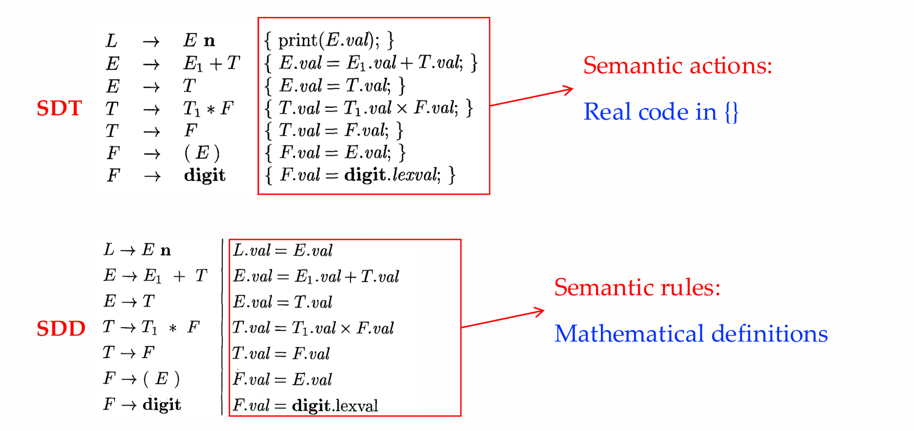
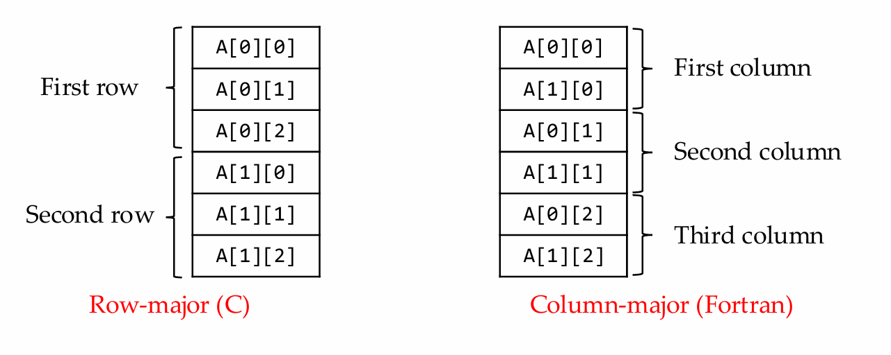
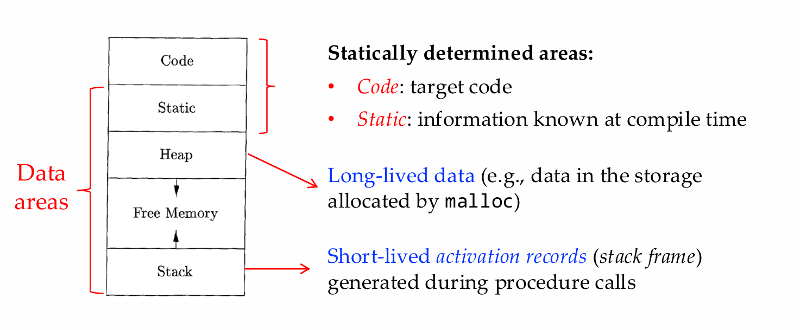
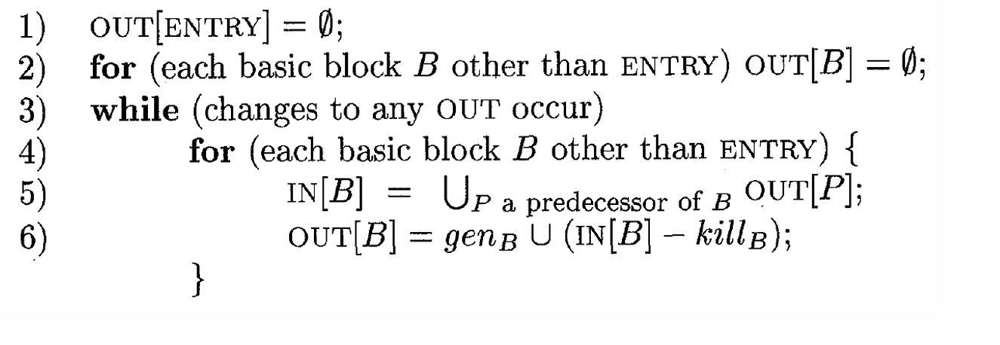

# CS323 Compiler Final Review

## Introduction

1. High-Level language <- Low-Level language，机器语言 -> 汇编语言 -> 高级语言

   一些早期高级语言的特点：

   1. Fortran(First High level language): for scientific computation 
   2. Cobol: for business data processing 
   3. Lisp: for symbolic computation

2. Compiler Structure 编译器的结构

   Source code -> 前端（Lexical, syntax, Semantic Analysis and Intermediate code generator）-> IR

   IR -> 后端（Machine-Independent Code Optimizer, Code Generator, Machine-Dependent Code Optimizer）-> 机器语言

   - 词法分析，生成token stream. 
     - Lexeme词素是源代码中具有某种特定意义的最小单元，它是程序文本中的实际字符序列，表示某个语言构造的具体实例(Instance)
     - Token 词法单元 词法单元是词素在词法分析过程中被分类后的抽象符号或标签(pattern) <token_name, attribute_value>
   - 语法分析，生成语法树
   - 语义分析，主要进行类型检查、转换
   - 中间代码生成，生成IR(typically 三地址码)
   - Machine-Independent Code Optimizer 机器无关代码优化，输出优化之后的IR
   - 代码生成 Code generation，生成目标代码target code

3. Compiler VS Interpreter

   Compiler translates source code in high-level language -> machine code.

   Interpreter directly execute source code without compiling.

   用解释器解释的编程语言在碰到第一个error时候停止，用编译器的在全部编译成功之后开始运行

## Lexical Analysis （词法分析）

1. 正则表达式

   1. prefix, proper prefix, suffix, proper suffix(不是空集且不等于自己)
   2. substring, proper substring, subsequence, string concatenation, exponentiation
   3. A language is any countable set1 of strings over some fixed alphabet
   4. 并，连接，Kleene闭包($a^*$)，正闭包($a^{+}$)
   5. Precedence (优先级): closure * > concatenation > union  | AND  left associative
   6. r? = r | $\epsilon$

2. 有穷自动机

   - NFA 非确定有穷自动机(S, $\sum$(input string), start state, transition function, accept state)

   - DFA 确定有穷自动机 for {s,a}, exactly one edge out

   - NFA -> DFA

     ★关键算法 Subset Construction Technique 子集构造法	

     - 𝜖-closure(s) ，𝜖-closure(T)，move(T,a)
     - 找状态集合，然后找空集闭包，设为新状态，从新状态出发对每个input求新的集合然后再求闭包

   - 正则表达式 -> NFA

     ★ 关键算法 Thompson's construction algorithm

     出现conflict先接受先specify的

## Syntax Analysis（语法分析）

1. Parser 分类

   Universal parsers (通用语法分析器) Some methods (e.g., Earley’s algorithm1) can parse any grammar ▪ However, they are too inefficient to be used in practice 

   Top-down parsers (自顶向下语法分析器) ▪ Construct parse trees from the top (root) to the bottom (leaves) 

   Bottom-up parsers (自底向上语法分析器)

2. CFG几个重要的部分（terminal, non-terminal, start symbol, production）

3. 上下文无关文法是描述语言生成规则的工具，而上下文无关语言是通过这些规则生成的语言。

4. derivations(left-most one-to-one parser trees; right-most many-to-one parser trees)

5. sentential form(文法的句型) 是推导中可能出现的表达形式，其中可能包括non-terminal

6. sentence(句子) 是最终输出，其中都必须是terminal

7. parse tree 是对derivation的表示，而AST(抽象语法树)是对源代码的抽象结构，不关注细节

8. 文法的ambiguity，即对一个sentence可以有多个parse tree，就代表文法存在二义性

9. 正则表达式(regular expression) 表达能力小于 CFG，即所有可以由RE表示的都可以由CFG表示

10. 语法分析技术

    - 自顶向下方法(Top-down parser) predict-match, leftmost 要求文法为LL(1) 否则需要处理冲突

      1. Recursive-descent parsing

         Recursive-descent parsers needing no backtracking can be constructed for a class of grammars called LL(1)

         它直接使用文法的产生式来构造递归调用。每个文法规则都对应一个函数（或过程），该函数会根据输入字符串中的字符来进行递归调用

      2. Non-recursive predictive parsing

         **Table-Driven Predictive Parsing**(递归向下寻找表达式替代 FIRST FOLLOW集合的构造，构造预测分析表，如果没有冲突则是LL(1))

    - 自底向上方法(Bottom-up parser) shift-reduce, rightmost

      相对于LL LR的好处如下

      1. Table-driven (like non-recursive LL parsers) and powerful
      2. LR-parsing is the most general nonbacktracking shift-reduce parsing method known
      3. LR grammars can describe more languages than LL grammars

      需要定义

      1. Augumented grammar
      2. two funtions : CLOSURE, GOTO

      LR Parsing Table: ACTION + GOTO

      1. SLR 基于 LR（0）
      
         需要掌握具体算法细节☆

      2. CLR 基于 LR（1）
      
      3. LALR
      
      表达的语言CLR > LALR > SLR  state个数 CLR > LALR = SLR Driver programs 均相等

## Syntax-Directed Translation(语法制导的翻译)

### SDD Introduction

1. Definition : A syntax-directed definition (语法制导定义,SDD) is a context free grammar together with attributes and rules

   Attribute（属性）A set of attributes (属性) is associated with each grammar symbol

   Semantic rule（语义规则）is associated with a production and describes how attributes are computed

2. 合成属性(Synthesized Attribute) 合成属性是从子节点传递到父节点的属性。也就是说，合成属性的计算依赖于子节点的值，而计算的结果将传递给父节点。 可以在Botton-up parser中直接获取

3. 继承属性(Inherited Attribute)  Inherited attributes have their value at a parse-tree node determined from attribute values at the **node itself, its parent, and its siblings** in the parse tree

### Evaluation Orders for SDD’

Dependency graph（依赖图）根据语义动作连接，然后TOPO标序号

1. S-attributed SDD An SDD is S-attributed if every attribute is synthesized

   So, S-attributed SDDs can be easily implemented during  bottom-up parsing (using 后序遍历)

2. L-attributed SDD

   An SDD is L-attributed if for each production 𝐴 → 𝑋1𝑋2…𝑋𝑛, for  each 𝑗 = 1…𝑛, each inherited attribute of 𝑋𝑗 depends on only: the attributes of 𝑋1,…,𝑋𝑗−1 (either synthesized or inherited ), or  the inherited attributes of A

   OR it's a S-attributed SDD

   Dependency-graph edges can go from left to right (on  an annotated parse tree), but not right to left (hence the  SDD is named “L-attributed”)
   
   S-attributed SDD 是 L-attributed SDD的子集
   
   使用dfs遍历，遍历时候记得从左边向右边，因为这样可以使得左边的siblings已经被提前evaluated

### Syntax-Directed Translation Schemes

SDT -> Semantic action(Real code in {}) WHILE SDD -> Semantic rule(Mathmetical definitions)

SDT sometimes can be implemented during parsing without first building a parse tree

如何determine能否做到这一点呢? 通过引入标记非终结符M and M → ε  for embedded action 如果标记该文法能够被该解析之后方法无冲突有效处理，那么说明通过这种方法能够 **在解析过程中实现 SDT**4

**SDT**的构造

## Intermediate-Code Generation(中间代码生成)

IR是前端的最后步骤

### Intermediate Representation

1. Constructing DAG

2. **Three-Address Code**

   A variable has l-value and r-value:  L-value (location) AND R-value (content)

   Three typical representations

   1.  Quadruples (四元式表示方法) op arg1 arg2 result

   2. Triples (三元式表示方法)  op, arg1, arg2 arg2处放置的通常是之前表达式的行号，相当于就是result

      without generating temporary names  **(an optimization over quadruples)**

      **BUT** 在优化时候，通常会涉及到位置交换，这样Triple就会受到影响，但是Qua就不会有影响

   3. Indirect triples (间接三元式表示方法)

      一个提升就是 It consists of a list of pointers to triple，这就在re-ordering时候很方便

   Static single-assignment form (SSA, 静态单赋值形式) 用x1,x2....

### Type and Declarations

1. Type Expression

   Types have structure, which can be represented by type expressions : A type expression is either a basic type, OR Formed by applying a type constructor (类型构造算子) to a type expression

   basic type OR type name(self-constructed)

2. Type Equivalence

   - Name Equivalence(名等价) 

     Two type expressions are name equivalent if and only if they are identical  (represented by the same syntax tree, with the same labels)

   - Structural Equivalence(结构等价)

      For named types, replace the names by the type expressions and recursively check the substituted trees

3. **Translation Process Example** detailed please refer to lec05-slide40

### Type Checking

A language is strongly typed if the compiler guarantees that the  programs it accepts will run **without type errors**(sound type system) Strong typed(Java...)  Weakly typed(C/C++...)

类型合成 && 类型推导

**Type Conversion** 类型转换

1. Widening conversion 保留信息，相当于implicitly type conversion 可以由compiler自动完成
2. Narrowing conversion 丢失信息，相当于explicitly type conversion 需要由programmar手动完成
3. SDT过程中有两个函数来处理(针对widening)
   - max(t1,t2) 返回least upper bound.
   - widen(a,t,w) generates type conversions if needed to widen an address 𝑎 of type 𝑡 into a value of type w.

### Arrays Addresses

1. 一维数组 𝒃𝒂𝒔𝒆+𝒊∗𝒘 (𝑏𝑎𝑠𝑒 is the relative address of 𝐴[0], 𝑤 is the width of an element) 

2. 二维数组(row-major layout) 𝒃𝒂𝒔𝒆 + 𝒊𝟏∗𝒘𝟏+𝒊𝟐∗𝒘𝟐(𝑤1 is the width of a row, 𝑤2 is the width of an element)

   

   行优先布局，列优先布局

## Run-Time Environments (运行时刻环境)

它主要有这些功能:

Layout and allocation of storage locations for data in the source program

AND Mechanisms to access variables

AND Linkages between procedures, the mechanisms for passing parameters

###  Storage Organization

构成如下

1. Static: the storage-allocation decision can be made by the compiler by looking only at the program text

2. Dynamic: 运行时候的决定

   Stack Storage （栈区）: The space for **names local** to a procedure is allocated on a stack. The lifetime of the data is the same as that of the called procedure Short-lived activation records

   Heap Storage (堆区) ：Hold data that may outlive the call to the procedure that created it（Long-lived data）

   - Manual memory deallocaion 手动回收内存
   - Automatic memory deallocation 垃圾回收

### Stack Space Allocation

1. 活动树(activation tree)

   对于一个活动树: Each node corresponds to one activation (children nodes are ordered) && The root is the activation of the “main” procedure

   FILO CALLs 遵循preorder RETURNs 遵循postorder

2. 活动记录(activation record)

   Procedure calls and returns are usually managed by a run-time stack called the **control stack** (or call stack)

   Each live activation has an activation record (or stack frame) on the **control stack**

   相当于就是记录哪些activation tree上的node还是active状态

   Activation Record中的信息：Actual parameters, Returned values, Control link, Access link,  Saved machine status,  Local data, Temporaries

3. Calling Sequences(方法调用序列)

   **Calling sequences**, consisting of code that 

   (1) allocates an activation record on the stack and (2) enters information into its fields

   **Return sequence (返回代码序列)** restores the state of the machine so that the caller can continue its execution after the call

   他们的作用：

   1. data方面 Correctly pass arguments to the callee && Correctly pass the return values to the caller 正确的进行了传值
   2. control方面 Correctly transfer the control to the first instruction of the callee && Correctly transfer the control back to the caller so that it can continue with the instruction immediately after the procedure-call statement 完成了控制权的转换

   Calling 和 Return 的对应的Step （此处略）

### Heap Management

堆中的分配例如Java中的new，C中的malloc，可以较长时间的live

deallocate 例如Java中的garbage collector自动回收，C中的free, delete

Properties: Space efficiency, Program efficiency, Low overhead

### Program Locality (程序局部性)

1. Temporal locality (时间局部性): the memory locations accessed are likely to  be accessed again within a short period of time
2. Spatial locality (空间局部性): memory locations close to the locations accessed are likely to be accessed within a short period of time

### Reducing Fragmentation(减少内存碎片化)

程序开始时候Heap是在一个连续的free空间上的，但是随着allocate memory的进行the memory manager must place the requested memory into a large-enough hole

接着With each deallocation request, the freed memory are added back to the pool of free space 

碎片化现象会降低效率 下面有几种approaches

1. Best-fit algorithm: Allocate the requested memory in the smallest available hole that is large enough
2. First-fit algorithm: An object is placed in the first (lowest-address) hole in which it fits 花费更少的时间提高spatial locality 但是在整体表现上差于best-fit
3. 但是best-fit算法需要遍历每个容器，效率很低，于是提出了几个strategy
   - binning strategy 分成 Separate bins
   - Doug Lea's strategy: aligns all chunks to 8-byte boundaries (i.e., chunk size is always a multiple of eight)

## Code Generation（代码生成）

TASKs:

1. Instruction selection 
2. Register allocation and assignment 
3. Instruction ordering

### Addresses in target code

1. Handling procedure calls and returns

   - Static allocation (静态分配) 

     Definition: The size and layout of activation records are determined by the code generator via the information in the symbol table

   - Stack allocation (栈式分配)

     栈分配是指将内存分配在程序运行时的**调用栈（call stack）**上。

     Static allocation使用的是绝对地址，而stack allocation使用的是相对地址

     usually in activation record

2. Handling names

   对应的symbol-table entry

### Basic Blocks and Flow Graph

1. 基本块切分算法

   三个法则需要遵从

   1. The first instruction in the entire intermediate code is a leader 
   2. Any instruction that is the target of a (un)conditional jump is a leader 
   3. Any instruction that immediately follows a (un)conditional jump is a leader

   按照这样将三地址码程序切分成基本块

2. 控制流图构造算法

   对于刚才构造的block图，添加边，meaning跳转关系或者自然运行关系

   loop的定义在控制流图中的环

### Optimization of Basic Blocks

几种策略

1. 构造DAG 找到Local subexpression(eliminating)，可以进行复用或者合并
2. Dead Code Elimination
3. The Use of Algebraic Identities （代数恒等式的应用）

### Registers

Two important data structures:

1. Register descriptor (寄存器描述符):  For each available , keeping track of the variable names whose current  value is in that register 
2. Address descriptor (地址描述符): For each program variable,  keeping track of the locations where the current value of  that variable can be found (A location may be a register, a memory address, a stack location)

**Register Allocation**

Assign specific values to certain registers, which simplifies the design and implementation of a compiler 

However, inefficient uses of registers may occur. Certain registers may go unused, while many loads and stores are  generated for the other register

**Global Register Allocation**

To save stores and loads, we can assign registers to frequently used variables and keep these registers consistent across block 2boundaries (globally)

## Introduction to Data-Flow Analysis (Code optimization)

We associate with every program point a **data-flow value** that represents an abstraction of program states observed for that point. 给每个程序中的位置一个数据流值，代表一个抽象的观测值

The data-flow problem is to find a solution to a set of constraints on  the IN[s]’s and OUT[s]’s for all statements 

1. Constraints based on the semantics of the statements (“transfer functions”) 
2. Constraints based on the flow of control

总之，为了找到可能改变数据流值的步骤以及控制可能传播这个值的flow

### Reaching definition

如果定义(definition, assign, ...)d能到达某个点p而不被kill(或者被别的步骤modify)，那么d是对x的last definition，称这些步骤为reaching definition

根据每个block的gen,kill集合根据以上算法计算Out

最后经过几个iter之后没有更新了就到达了fixed point