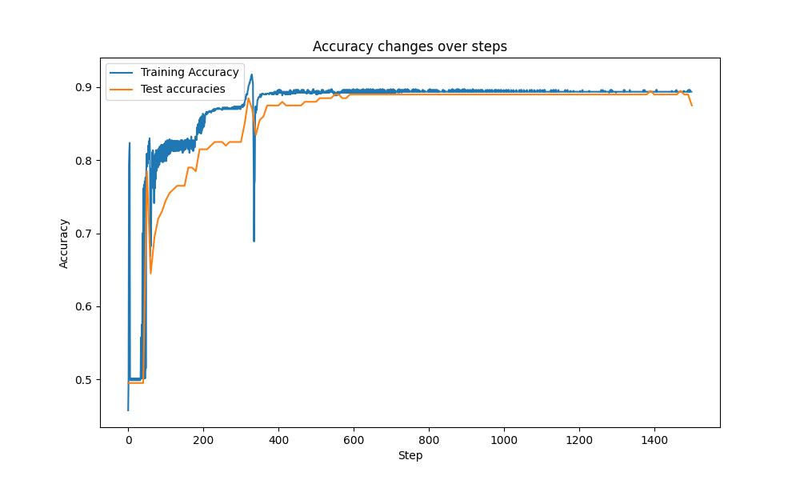

# CS324 Deep Learning Assignment 1

​																		SID: 12210731 Name: 陈长信


## 	Part Ⅰ Perceptron

### Data generation

In order to generate a dataset in $R^2$, I use package `numpy` to generate random points following Gaussian distribution. The Gaussian parameters are as follows (Default version)

|               | Mean  | Var  | Num of points |
| ------------- | ----- | ---- | ------------- |
| Distribution1 | (0,0) | 1    | 100(80+20)    |
| Distribution2 | (2,2) | 1    | 100(80+20)    |

Additionally, I assign a label to each of the generated points to notify which distribution it is in

```python
labels = [-1] * 100 + [1] * 100
data = pd.DataFrame(dataset, columns=["x", "y"])
data["label"] = labels
```

Plot is in Appendix `[Gaussian Distributions in Part I]`


### Perceptron & Implementation

Main idea of Perceptron should be the following steps:

1. Initialize parameters

   ````python
   # Initialization
   self.n_inputs = n_input
   self.max_epochs = max_epochs
   self.learning_rate = learning_rate
   # after adding bias, needs to add 1 to its dimension
   self.weights = np.zeros(n_inputs + 1)
   ````

   Notice: Instead of using $f(xi,W,b) = Wxi + b$, here I expand the dimension of weights just like putting them together while adding an extra "1" to the input_vec, which will be down during the process of "forward".

2. Forward move

   Just like discussed before, here we adding "1" to `input_vec`. Then use np.dot to calculate $Wxi$ and finally output the activated result with `Sign` Function.

   ```python
   # Compute the dot product between weights and inputs
   activation = np.dot(self.weights, input_with_bias)
   # Return the predicted label (1 if positive, -1 if negative)
   return 1 if activation >= 0 else -1
   ```
   
3.  Training (According to "Standard Algorithm")

   After computing the predictions of the perceptron following the process of forward move, now we need to compute the gradient of loss function, which is
   $$
   -\frac{1}{N}Σ(xi * yi)
   $$
   After evaluating the performance of this weights, then we need to upgrade it by using $w ← w − 𝑙𝑟 ∗ 𝑔𝑟𝑎𝑑𝑖𝑒𝑛t$, where lr refers to Learing Rate.

   To implement this, what we need is only a set `misclassified[]` and a loop to manipulate it.

   ```python
   misclassfied = []
   for i in range(N):
   	# ...
   	# record misclassification
   	prediction = self.forward(input_vec)
   	if label * prediction < 0:
   		misclassfied.append(i)
   # To see if any misclassification, if did then use the formula to upgrade the weights
   if len(misclassfied) > 0:
   	for i in misclassfied:
       	input_with_bias = np.append(training_inputs[i] , 1)
       	gradient -= labels[i] * input_with_bias
       # 1/N            
       gradient /= len(misclassfied)   
       # Upgrade
       self.weights = self.weights - self.learning_rate * gradient
      
   
   ```
   

### Default parameters

In the first part, here is a default parameter list.

| Parameter        | Value       |
| ---------------- | ----------- |
| max_epoches      | 100         |
| Learning rate    | 0.01        |
| Number of points | 200(160+40) |
| Var1=Var2        | 1           |


### Test & Evaluation

To test the performance, I evaluate the accuracy of the test result every . The process is quite simple, just calculate the number of correctly classified points among all the test points and calculate the ratio.

As a result, the result is about 87 percent.(test 100 times and output accuracy of all the tests, tested based on different generated testcases)


### Further experiments

To conduct more experiments, I change the Var value. Then I test them based on generated testcases. Here is the result.

| (means\|VarValue(var1=var2)) | 2      | 1      | 0.5    |
| ---------------------------- | ------ | ------ | ------ |
| (0,0) and (3,3)              | 87.60% | 96.22% | 99.57% |
| (0,0) and (2,2)              | 74.45% | 86.82% | 95.25% |
| (0,0) and (1,1)              | 56.50% | 66.53% | 76.40% |
| (0,0) and (0.5,0.5)          | 54.25% | 57.32% | 61.22% |

Clearly and obviously, when Var decreases, the accuracy increases, and when the mean values of two samples are farther and farther away, the better the model is, the higher the accuracy will be.


## Part Ⅱ Multi-layer Perceptron

### Data generation

In this part, I use `makemoons` method to generate data, with noise = 0.2.

```python
X, y = make_moons(n_samples=1000, noise=0.2)
```

Plot is in Appendix `[Makemoons method plot in Part II]`

After generating the points, then we translate it into one-hot code.

```python
num_classes = len(np.unique(y))
y_one_hot = np.eye(num_classes)[y]
```


### MLP & Implementation

Compared to simplest perceptron, which usually be achieved by finding weights that better fit the given dataset. Typically, we use Gradient Decline to implement.

In short, the work each layer in MLP have to do is to deal with the output from the previous layer, and combine them using the idea of single perceptron and then use appropriate function to activate it. Finally propagate to the next one.

To illustrate this, for all $N$ layers, we use the idea from simplest perceptron. That is $W^{N}$represents every connection weight between two neightbour sets of neurons, which means the size should be $[N(n),N(n-1)]$. However, in MLP, we use diverse activation function, $softmax,ReLU,sigmoid...$. Finally, entropy loss should be implemented.

Totally, $X(n) = f(W(n)X(n-1)+b(n))$, where f is the corresponding activation function.

Additionally, backward propagation should also be implemented. The core idea is to use the final cross entropy loss to calculate every layer's gradient in reverse order.(By applying The Chain Rule)
$$
\frac{\partial L}{\partial W^l} = \delta^l \cdot (h^{l-1})^T
$$
$h^{l-1}$ refers to the activation results of layer $l-1$, $\delta^{l}$ refers to the error of  layer l. (For the output layer, it should be simply $y-t$, while other layers should be $\frac{\partial L}{\partial (h^{n-1})}$ and $h^{n-1}$ is the activation result of the previous layer)

As a result, for every layer, the formulation of adjusting the weight matrix is as following
$$
W^{i} = W^{i} - η\frac{\partial L}{\partial W^i}
$$

1. Initialize parameters

   For initialization, params and grads should both be stored in the beginning.

   ```python
   # Initialize weights and biases with the correct shapes.
   self.params = {"weight": None, "bias": None}
   self.grads = {"weight": None, "bias": None}
   # initialize weights into small random values using normal distribution and also with suitable matrix size.
   self.params["weight"] = np.random.randn(in_features, out_features) * 0.01
   self.params["bias"] = np.zeros(out_features)
   ```

   When manipulating layers in MLP, parameters should also be initialized. Firsly, we can create a layers list to record all the layers include Linear layers and activation layers(using ReLu()).

   ```python
   in_features = n_inputs  # input dimension
   # Add hidden layers
   for n_units in n_hidden:
   	self.layers.append(Linear(in_features, n_units))  # Linear layer
   	self.layers.append(ReLU())  # activation layer
   	in_features = n_units  # upgrade the dimension
   ```

2. Forward move

   In this step, every layer just need to propagate the value to the next one.

   1. For Linear one, I use method same as single perceptron $out = Wxi + b$

      ```python
      self.x = x
      return x @ self.params["weight"] + self.params["bias"]
      ```

   2. For activation layer, when it comes to ReLu, we use $max(0,xi)$

      ```python
      self.if_back = (x > 0)
      return np.maximum(0, x)
      ```

   3. When it comes to SoftMax, I use
      $$
      softmax(x_i) = \frac {exp(x_i)}  {sum(exp(x_j))}
      $$

      ```python
      x_shifted = x - np.max(x, axis=1, keepdims=True)  # Avoid overflow
      exp_x = np.exp(x_shifted)
      self.probs = exp_x / np.sum(exp_x, axis=1, keepdims=True)  # calculate softmax and keep the dimension
      return self.probs
      ```

      Finally, for calculating crossentropy, I use $L = -sum(y_i * log(p_i))$

      ```python
      self.y = y
      return -np.sum(y * np.log(x + 1e-12))  # add 1e-12 to avoid log(0)
      ```

3. Backward move

   Just like what I did in Forwarding process, here Ie also divide in three parts.

   1. For linear part, I implement the chain rule. First we should accept the gradient result from the next layer(since we are doing this in the reverse order), then we follow the previous formula to determine how to adjust the grads of the current layer, which will affect next epoch.

      For illustration, from $Z = Wx + b$, we can have $\frac{\partial Z}{\partial W} = x^{T}$. Then by appling the chain rule, at the end we can have
      $$
      \frac{\partial L}{\partial W} = x^{T} * dout(dout = \frac{\partial L}{\partial Z})
      $$

      ```python
      self.grads["weight"] = self.x.T @ dout
      self.grads["bias"] = np.sum(dout, axis=0)
      return dout @ self.params["weight"].T
      ```

   2. For activation layer, which is ReLu function. Backward propagation is quite easy. The gradient is 1 for `x > 0`, otherwise 0.

   3. For softmax output followed by cross-entropy loss, the gradient simplifies to: p - y.

      so `return x - y` should be fine.

4. Training

   To train this MLP model, every time I go through all the layers and get `CrossEntropy()` result. Building on that, I move backward to the begining hidden layer to change gradient of each layer. Finally, I update every Linear layer's weights and bias by implementing simple gradient descent.

   ```python
   # 1. Forward pass
   out = model.forward(x_i)
   # 2. Compute loss
   loss = loss_function.forward(out, y_i)
   # 3. Backward pass (compute gradients)
   dout = loss_function.backward(out, y_i)
   model.backward(dout)
   # 4. Update weights
   for layer in reversed(model.layers):
   	if isinstance(layer, Linear):
   		layer.params["weight"] -= learning_rate * layer.grads["weight"]
   		layer.params["bias"] -= learning_rate * layer.grads["bias"]
   ```


### Default Parameter

In the test of this part, the value of parameters are as followed.

| Parameter          | Value                      |
| ------------------ | -------------------------- |
| dnn_hidden_units   | "20"(only on hidden layer) |
| learing rate       | 0.01                       |
| max_steps          | 1500                       |
| eval_freq          | 10                         |
| train_test_samples | 1000(800+200)              |


### Test & Evaluation

To test the performance of the trained model, I test and output the accuracy of the model using the test sample every 10 epochs .

```python
if step % eval_freq == 0 or step == max_steps - 1:
	# 1. Forward pass on the test set
	# 2. Compute loss and accuracy
    test_predictions = model.forward(X_test)
	test_loss = loss_function.forward(test_predictions, y_test)
	test_accuracy = accuracy(test_predictions, y_test)
	print(f"Step: {step}, Loss: {test_loss:.4f}, Accuracy: {test_accuracy * 100:.2f}%")
```

Loss Curve & Accuracy Curves are as following(Whole size as one, `batch_size = 800`):

As a result the final accuracy is approximately 86%.

| Loss curve                                                   | Accuracy curve                                               |
| ------------------------------------------------------------ | ------------------------------------------------------------ |
|  |  |


##  Part Ⅲ Stochastic Gradient Descent

To implement this method, I modify the function `train()`in last part. Specifically, parameter `sgd`was added.

```python
def train(dnn_hidden_units, learning_rate, max_steps, eval_freq, sgd=False)
```

When using Command Line Operator, client can add `if_sgd` parameter to determine which training method to use.(Default value of `if_sgd` is set to be `False`)

```python
python train_mlp_numpy.py --dnn_hidden_units 20 --learning_rate 0.01 --max_steps 1500 --eval_freq 10 --if_sgd True
```


### Implementation

This part just need to add a check statement to determine the training method. Then shuffle the sample and get a random example.

```python
if sgd:
	batch_size = 1
	for i in range(0, X_train.shape[0], batch_size): 
		x_i = X_train_shuffled[i : i + batch_size]  # Get the single sample
		y_i = y_train_shuffled[i : i + batch_size]  # Get the corresponding label
```


### Test & Evaluation

Assume `Batch.size == 1`,  which means update the weights for every sample. I test the accruacy curve.

For further test and train_curve, please refer to next section`Further Experiment`.

As a result, final accuracy is good, with approximately 95% in good situation.

In average, the performance is 87% approximately.


### Further Experiment

In this part, I change `Batch_size` to different values to see the performance.(`Testcases[] = 1,5,20,100,400,600`)

|                     |  |
| -------------------------------------------- | ------------------------------------------ |
| Batch_size = 1(Best 95% Average 87%)         | Batch_size = 5(Best 97% Average 89%)       |
|  |               |
| Batch_size = 20(Best 97% Average 92%)        | Batch_size = 100(Best 97% Average 94%)     |
|                 |               |
| Batch_size = 400(Best 98% Average 97%)       | Batch_size = 600(Best 96% Average 91%)     |

To analyze, batch_size should be not too large or too small. Among all those testcases, the best batch_size is 400, with even approximately 97% accuracy in average.

### Analysis

Why we should choose a proper batch_size?

I think there are several reasons.

**Not too large**:

1. Require more memory.
2. Slower convergencec, which may lead to worse performance when the epoch cycles are not enough

**Not too small**:

1. Too much training time
2. The updates based on small batches can introduce more noise, causing the training to be less stable.

In conclusion, based on that, when we use Batch Gradient Descent or Stochastic Gradient Descent, choosing a proper batch size is necessary.


## Appendix

### Gaussian Distributions in Part I


### Makemoons method plot in Part Ⅱ

