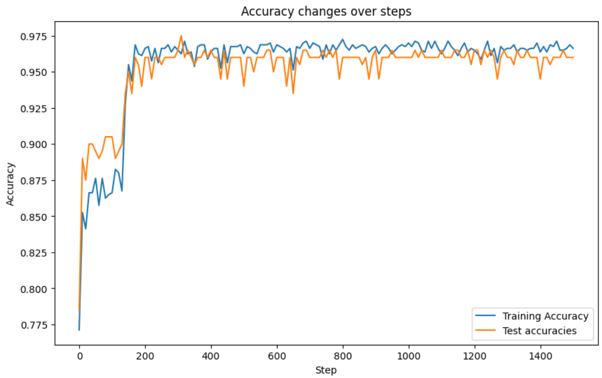
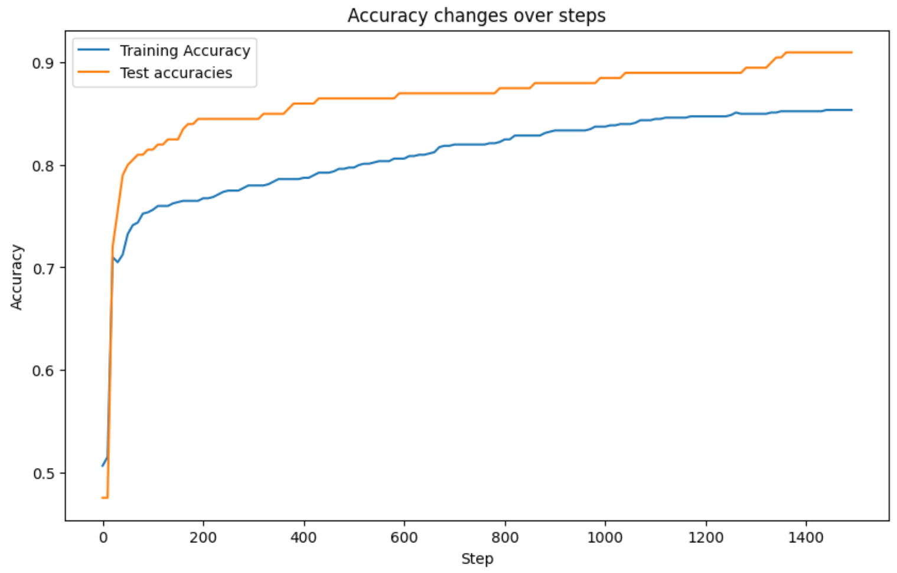
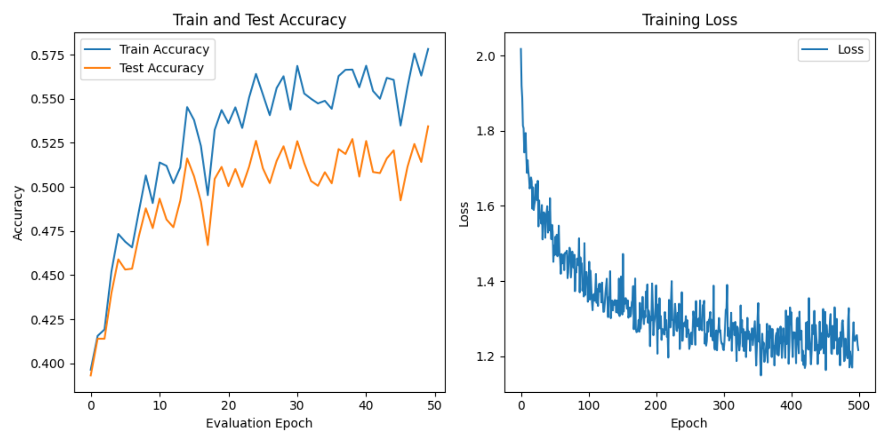
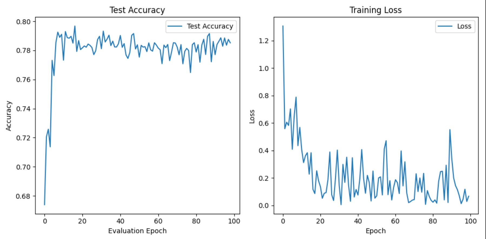
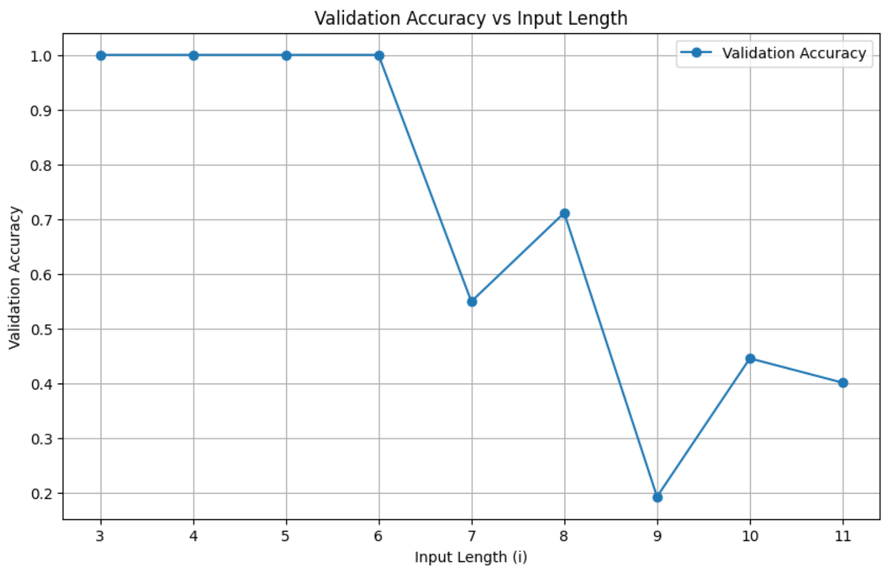

# CS324 Deep Learning Assignment 2

​																																		SID: 12210731 Name: 陈长信

## Part 1 PyTorch MLP

###  MLP architecture implementation

In this part, I implement the basic structure of standard MLP. Compared to previous assignment, here I use `pytorch` package to help me accomplish.

`pytorch_mlp.py` file, which contains the basic class structure of MLP. Obviously, during the `forward()` process we can output the value **without Softmax activation**

```python
super(MLP, self).__init__()
layers = []

# input layer
layers.append(nn.Linear(n_inputs, n_hidden[0]))
layers.append(nn.Sigmoid())

for i in range(1, len(n_hidden)):
layers.append(nn.Linear(n_hidden[i - 1], n_hidden[i]))
layers.append(nn.Sigmoid())

# output layer
layers.append(nn.Linear(n_hidden[-1], n_classes))

# Generate model
self.model = nn.Sequential(*layers)
```

`pytorch_train_mlp.py` file, which contains the procedure of model training. Before training, we have to transfer the data type to `tensor` type, which torch can understand and transmit the data to device(in this part I only use my own CPU and please see the appendix for configuration details.)

```python
# Convert training and testing data to PyTorch tensors
X_train_tensor = torch.tensor(X_train, dtype=torch.float32).to(device)
y_train_tensor = torch.tensor(y_train, dtype=torch.long).to(
        device
)
X_test_tensor = torch.tensor(X_test, dtype=torch.float32).to(device)
y_test_tensor = torch.tensor(y_test, dtype=torch.long).to(device)

# TensorDataset and DataLoader
train_dataset = TensorDataset(X_train_tensor, y_train_tensor)
train_loader = DataLoader(train_dataset, batch_size=BATCH_SIZE, shuffle=True)

# initialize MLP and loss model(here I use SGD for optimizer)
model = MLP(input_dim, dnn_hidden_units, output_dim)
loss = nn.CrossEntropyLoss()
optimizer = torch.optim.SGD(model.parameters(), lr=FLAGS.learning_rate)

for X_batch, y_batch in train_loader:
	optimizer.zero_grad()  # Clear gradients
	outputs = model(X_train_tensor)  # Forward pass
 	softmax = nn.Softmax(dim=1)  # softmax activation
	outputs = softmax(outputs)
	final_loss = loss(outputs, y_train_tensor.argmax(dim=1))  # Calculate loss
	final_loss.backward()  # Backward pass
	optimizer.step()  # Update weights


```

### Performance analysis

To test the performance, I use `make_moon` methods, which is the same as assignment 1.

```python
X, y = make_moons(n_samples=1000, noise=0.2)
```

After testing them with the same `make_moons` dataset and same default parameters using stochastic gradient descent, I get the following testing results.

```
# Default constants
DNN_HIDDEN_UNITS_DEFAULT = "20"
LEARNING_RATE_DEFAULT = 1e-2
MAX_EPOCHS_DEFAULT = 1500
EVAL_FREQ_DEFAULT = 10
Batch_SIZE = 100
```

|  |  |
| :----------------------------------------------------------: | :----------------------------------------------------------: |
|                          numpy_MLP                           |                         Pytorch_MLP                          |

From the above chart, we can see that the accuracy of the MLP manually implemented with numpy reached 96%, and the accuracy of the MLP with pytorch reached 91%, and the accuracy is similar. However, it can be seen from the chart that the manually implemented MLP is still slightly due to the library function of pytorch, and the manually implemented MLP has obvious vibration on the image. Why is this? I think there are several reasons:

1. PyTorch uses Kaiming or Xavier initialization by default, while manual implementation use random relatively small numbers.
2. PyTorch perform numerical stability on some gradient computations.
3. In general, the manually implemented MLP is more random, which may mean that it is easier to jump out of local values, but the gradient descent of pytorch is more stable, which makes the increment of curve smoother and is not easy to jump out of local extreme values.

**For detailed code and run results you can refer to `pytorch_mlp.py`, `pytorch_train_mlp.py`, `part1-MLP.ipynb`**


### CIFAR10 dataset

In order to deal with more complex testcases, here I use CIFAR10 dataset, which contains 5 batches with 10k train samples each and 1 test batch. In this part, I use GPU(for configuration please see the Appendix)

1. Firstly, I download the dataset to my local. Then I write two functions for pre-process the dataset.

   ```python
   def unpickle(file):
       import pickle
       with open("data/cifar-10-batches-py/" + file, "rb") as fo:
           dict = pickle.load(fo, encoding="bytes")
       return dict
   
   def load_cifar10_data():
       data_files = ['data_batch_1', 'data_batch_2', 'data_batch_3', 'data_batch_4', 'data_batch_5']
       
       all_data = []
       all_labels = []
       
       # load all data
       for file in data_files:
           data_dict = unpickle(file)
           all_data.append(data_dict[b'data'])
           all_labels.append(data_dict[b'labels'])
       
       all_data = np.vstack(all_data)  # 合并所有数据
       all_labels = np.concatenate(all_labels)  # 合并所有标签
   
       return all_data, all_labels
   ```

2. Then, I use the similar method to the previous question. However, after several tests, I modify some of the parameters.

   ```python
   DNN_HIDDEN_UNITS_DEFAULT = "3000"
   LEARNING_RATE_DEFAULT = 0.001
   MAX_EPOCHS_DEFAULT = 1500
   EVAL_FREQ_DEFAULT = 10
   DECAY = 0.0005
   BATCH_SIZE = 2000
   
   optimizer = torch.optim.Adam(model.parameters(), lr=LEARNING_RATE_DEFAULT, weight_decay=DECAY)
   
   ```

   In order to solve the problem of overfitting, `DECAY `is introduced here, mainly to punish large weights, which can effectively solve the problem. However, too large `DECAY` will make the model invalid, and only a random prediction probability can be obtained in the end. In addition, the `ADAM` optimization mechanism is also used. Compared with `SGD` optimization, it can adjust the learning rate and converge faster. In addition, the random batch method is still used for learning in the processing of the data set, which can make the learning more average.

3. Performance.

   

   Note that the final result of this question is not very good, and it can only converge to about 55% accuracy. I think the possible reason is as following

   1. The best parameter ratio has not been found, and the other is that I think MLP is not necessarily suitable for this type of recognition task. 
   2. Too many parameters and too many connections between neurons will cause bad results. So next I will test the performance of CNN.
   
   **For detailed code and run results you can refer to `pytorch_mlp.py`, `CIFAR-10.py`, `part1-CIFAR10.ipynb`**


## Part 2 PyTorch CNN

### CNN Implementation

In the first part, I implement that CNN model according to the lecture, which is a reduced version of the VGG network.

`cnn_model.py`

```python
# Define the layers as per the simplified VGG architecture
self.conv_layers = nn.Sequential(
	nn.Conv2d(n_channels, 64, kernel_size=3, padding=1),
	nn.ReLU(),
	nn.Conv2d(64, 64, kernel_size=3, padding=1),
	nn.ReLU(),
	nn.MaxPool2d(kernel_size=3, stride=2),
 	nn.Conv2d(64, 128, kernel_size=3, padding=1),
	nn.ReLU(),
	nn.Conv2d(128, 128, kernel_size=3, padding=1),
 	nn.ReLU(),
	nn.MaxPool2d(kernel_size=3, stride=2),
)
# Fully connected layers
self.fc_layers = nn.Sequential(
	nn.Linear(
	128 * 7 * 7 , 1 * 1 * 512
	),
    nn.ReLU(),
    nn.Linear(512, n_classes),
)
```

The whole structure includes several convolutional layers and a fully connected layer. 

1. In the convolutional layers, I use a convolution kernel of size 3. The number of convolution kernels ranges from 64 to 128. After each convolution, a pooling operation with a step size of 2 is performed to reduce the number of pixel blocks, which is convenient for calculation and extraction of feature weights. 
2. Then finally, there will be a fully connected layer connected to the output layer.

`cnn_train.py`

This file contains the training process of CNN network. The dataset is traditional CIFAR-10 dataset, which is the same as the previous problem.

```python
model = CNN(n_channels=3, n_classes=10).to(device)
loss_fn = nn.CrossEntropyLoss()
optimizer = optim.Adam(model.parameters(), lr=FLAGS.learning_rate, weight_decay=DECAY)
```

The above is a brief definition of models including `loss_function, optimizer`. However, the detailed training process will be skipped since is quite similar to MLP training.


### Performance test

In order to test the effect of the model, I adjusted the parameters. It is worth mentioning that I found that Epoch has converged at a relatively early age, and then I also used the Adam optimizer to adjust the learning rate. Here is the default parameter I adjust, which performances best during my experiments.

```python
# Default constants
LEARNING_RATE_DEFAULT = 0.0005
# use mini-batch
BATCH_SIZE_DEFAULT = 32
MAX_EPOCHS_DEFAULT = 100
EVAL_FREQ_DEFAULT = 10
OPTIMIZER_DEFAULT = "ADAM"
DECAY = 0.001
DATA_DIR_DEFAULT = "data/cifar-10-batches-py/"
FLAGS = None
```



It can be seen that this model quickly reached an accuracy of nearly 80%, but there is no way to improve the accuracy based on that model. The maximum accuracy is 79.69%

**For detailed code and run results you can refer to `cnn_model.py`, `cnn_train.py`, `part2.ipynb`**


## Part3 PyTorch RNN

The RNN model is a model for sequence data. So in this assignment I implement a RNN model to predict the last digit of a palindrome. Palindromes in general are strings that look the same when read forward and backward.

### Model implementation

To write the RNN myself, I use the following structure to construct the model.

1. Firstly, every state is the combination of the previous state and current input weights with its bias, that is
   $$
   h^{(t)} = \tanh(W_{hx}x^{(t)} + W_{hh}h^{(t-1)} + b_h)
   $$
   
   $$
   o^{(t)} = (W_{ph}h^{(t)} + b_o)
   $$

2. Then, activate it using Softmax also.
   $$
   \tilde{y}^{(t)} = \text{softmax}(o^{(t)}).
   $$

3. Finally, we compute crossEntropy(), which is used to evaluate the performance of the current model and adjust the weights.
   $$
   \mathcal{L} = - \sum_{k=1}^K y_k \log(\tilde{y}_k^{(T)}),
   $$
    where k runs over the classes (K = 10 digits in total), $y_k$ is a one-hot encoding vector.

`vanilla_rnn.py`

```python
self.Whx = nn.Linear(input_dim, hidden_dim, bias=False)
self.Whh = nn.Linear(hidden_dim, hidden_dim, bias=True)

self.bh = nn.Parameter(torch.zeros(hidden_dim))
self.Wph = nn.Linear(hidden_dim, output_dim, bias=True)

def forward(self, x):
	batch_size, input_length, _ = x.size()

	h = torch.zeros(batch_size, self.hidden_dim, device=x.device)
    
    # 遍历每一步
	for t in range(input_length):
		x_t = x[:, t, :]
		h = torch.tanh(self.Whx(x_t) + self.Whh(h) + self.bh)
	
    # 激活
    o = self.Wph(h)
	y_hat = torch.softmax(o, dim=1)

	return y_hat
```

`train.py`

```python
# for every epoch train the model
def train():
    for step, (batch_inputs, batch_targets) in enumerate(data_loader):
        batch_inputs, batch_targets = batch_inputs.to(device), batch_targets.to(device)
        outputs = model(batch_inputs)
        # compute loss and accuracy
        loss = criterion(outputs, batch_targets)
        acc = accuracy(outputs, batch_targets)
        # use optimizer to update and back propagation
        optimizer.zero_grad()
        loss.backward()

        optimizer.step()
        losses.update(loss.item(), batch_inputs.size(0))
        accuracies.update(acc, batch_inputs.size(0))
    return losses.avg, accuracies.avg
```

For every epoch, you train the model like stated above, which will iterate through each state of the sequence and update the weights.

### Train

During the training, I also modify some of the parameters to gain the best performances. Besides, here are some of the methods I use.

```python
criterion = nn.CrossEntropyLoss() 
optimizer = torch.optim.RMSprop(model.parameters(), lr=config.learning_rate, alpha=0.99) # alpha refers to decay rate
scheduler = torch.optim.lr_scheduler.StepLR(optimizer=optimizer, step_size=100, gamma=0.1)

learning_rate = 0.05
max_epoch = 300
max_norm = 10.0
batch_size = 32
num_hidden = 64
num_classes = 10
input_length = 5

```

Here, I use RMSprop optimizer and I config `alpha` value, which is used to automatedly control the gradient and will effectively reduce the degree of vibration.

To test length = 5, here is the performance.


If we add early-stopping, we can see the plot goes convergence at about epoch 100. At the end, the accuracy can go 100%.


### Further experiments & Analysis

In this part, I will test the model at different sample lengths(range from 3 to 11)



1. From the above chart, we can see that the accuracy does not change much when the length is short. In general, as the length increases, the accuracy gradually decreases. This is due to the limited memory of RNN. As the length increases, it takes too long and no test is performed.
2. The probability may fluctuate due to the limited data set, the number of epochs, and the local extreme value.
3. It is interesting to see that when the input is an even number, that is, when the total length is an odd number, the prediction accuracy is higher than when the input is an odd number. I think this may be because the symmetry of odd numbers is easier to capture. However, in general, whether it is for a sequence of length 1, 3, 5 or 2, 4, 6, the prediction accuracy shows an overall downward trend.

**For detailed code and run results you can refer to `train.py`, `vanilla_run.py`, `part3.ipynb`**

## Appendix

1. Default running environment
   - CPU: AMD Ryzen 7 6800H (8 cores, 16G RAM)
   - GPU: NVIDIA GeForce RTX 3090 (24G VRAM)
   - Python 3.12.2
2. The dataset of CIFAR-10 has been downloaded to the local directory. However, it was not submitted with the code. If you need to test it, you need to download the dataset first and add it to the corresponding directory.