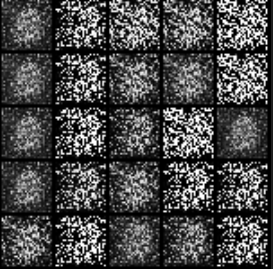

# CS324 Deep Learning Assignment 3

SID: 12210731 Name: 陈长信


## Part I: Pytorch LSTM

During this part, I will implement LSTM algorithm, which is usually used to solve RNN problem, using the well-known`pytorch` package. However, `nn.torch.LSTM` will not be directly use. Instead, I will construct my own LSTM with simple layers and connections provided by `Pytorch`

### LSTM structure

The main difference and upgrade of LSTM compared to RNN is we can effectively solve the problem of gradient explosion and gradient vanishing. LSTM use the following components:

1.  **Input gate**, which is to combine the input **previous hidden value and current value** and then determine how much information to update the **Long-term memory**.
2. **Output gate**, which is used to output current decision and determines how much information should be used to update the **Short-term memory**.
3. **Forget gate**, which is used to determine how much of the **Long-term memory** to remember with the combination of **previous Short-term and Long-term memory** and **current input**.

Generally, LSTM is commonly be implemented as following:

1. Firstly, we should determine the percentage the previous **Long-term** memory to remember. To be clear, we should use $h^{t-1}$ and $x^{t}$ to determine that. (**Forget gate**)
   $$
    f(t) = σ(W_{fx}x^{t} +W_{fh}h^{t-1} +b_f)
   $$
   where $h^{t-1}$ represent previous **Short-term memory**.

2. Secondly, we should determine how to update **Long-term** memory using $h^{t-1}$ and $x^{t}$.

   - we compute the percentage of **Short-term memory** we should remember. That is (**Input gate**)
     $$
     i(t) = σ(W_{ix}x^{t} + W_{ih}h^{t-1} + b_{i})
     $$

   - Then, we compute potention additional **Long-term memory** with "the inspiration" of current value and add it to the previous **Long-term memory**
     $$
     g(t) = tanh(W_{gx}x^{t} + W_{gh}h^{t-1} + b_g)
     $$

     $$
      c(t) = g(t) ⊙ i(t) + c(t−1) ⊙ f(t)
     $$

     where $c(t)$ refers to **Long-term memory** and notice that, we use $tanh$ activation function here, because the output is within the range of $[-1,1]$

3. Finally, we should determine our **Short-term memory** using the **New Long-term memory**

   - Similar to previous step, we compute the percentage memory we should remember from **Long-term memory** (**Output gate**)
     $$
     o(t) = σ(W_{ox}x^{t} + W_{oh}h^{t-1} + b_o)
     $$

   - Then, we compute the potention new **Short-term memory**
     $$
     h(t) = tanh(c(t)) ⊙ o(t)
     $$

Following the 3 steps below, we can build a framework of traditional LSTM.


### Detailed implementation

For initialiation part, I add sort of parameter as previously mentioned.

````python
# Initialize weight
self.W_f = nn.Parameter(torch.randn(hidden_dim, input_dim + hidden_dim))  # Forget gate weights
self.W_i = nn.Parameter(torch.randn(hidden_dim, input_dim + hidden_dim))  # Input gate weights
self.W_C = nn.Parameter(torch.randn(hidden_dim, input_dim + hidden_dim))  # State weights
self.W_o = nn.Parameter(torch.randn(hidden_dim, input_dim + hidden_dim))  # Output gate weights

# Initialize bias
self.b_f = nn.Parameter(torch.zeros(hidden_dim))  # Forget gate bias
self.b_i = nn.Parameter(torch.zeros(hidden_dim))  # Input gate bias
self.b_C = nn.Parameter(torch.zeros(hidden_dim))  # State bias
self.b_o = nn.Parameter(torch.zeros(hidden_dim))  # Output gate bias

self.fc = nn.Linear(hidden_dim, output_dim)
````

For update part, I follow the previous formulas.

````python
# Loop through the sequence
for t in range(self.seq_length):
    # Compute gates
    f_t = torch.sigmoid(torch.matmul(combined, self.W_f.T) + self.b_f)  # Forget gate
    i_t = torch.sigmoid(torch.matmul(combined, self.W_i.T) + self.b_i)  # Input gate
    C_new_t = torch.tanh(torch.matmul(combined, self.W_C.T) + self.b_C)  # Candidate memory
    o_t = torch.sigmoid(torch.matmul(combined, self.W_o.T) + self.b_o)  # Output gate

    # Update cell state and hidden state
    C_t = f_t * C_t + i_t * C_new_t  # New cell state
    h_t = o_t * torch.tanh(C_t)  # New hidden state
    # Final output
output = self.fc(h_t)  # Fully connected layer to get final output
return output
````

When training the LSTM model, I implement a similar method as the previous assignment.

````python
criterion = nn.CrossEntropyLoss()
optimizer = torch.optim.RMSprop(model.parameters(), lr=config.learning_rate, alpha=0.99)
scheduler = torch.optim.lr_scheduler.StepLR(optimizer=optimizer, step_size=100, gamma=0.1)
````

Here is default parameters' value I use.

````python
# Model params
input_length = 5
input_dim = 1
num_classes = 10
num_hidden = 128
batch_size = 128
learning_rate = 1e-3
max_epoch = 100
max_norm = 10.0
data_size = 10000
portion_train = 0.8
````


### Result analysis

Similarly, I use `PalindromeDataset` to test the performance of LSTM.

I test some of the lengths of the palindrome number. Here is a brief result.

Test with Lengh = 5 with Final accuracy  = 1


Then I do some extra bunch of tests. Surprisingly, the performance of LSTM is really great.

Compared to previous assignment, which is to use `RNN` to train the model, the performance improved a lot.

| Length = 10 with Final accuracy = 1                          | Length = 15 with Final accuracy = 1.0                   |
| ------------------------------------------------------------ | ------------------------------------------------------- |
|       |  |
| Length = 25 with Final accuracy = 1.0                        | Length = 30 with Final accuracy = 1.0                   |
|  |  |


## Part II: Generative Adversarial Networks (GAN)

During this part, I aim to implement a GAN network, which mainly includes two parts: Generator and Discriminator.

### Model struture

Generator aims to generate fake pictures or objects that which can fool the discriminator, which is also trained to judge whether a specific picture is fake or not.

During the training process, we normally follow the following steps:

1. When training the discriminator, the discriminator labels the true pictures from external environment and fake pictures from generator. It aims to lower the error rate
2. When training the generator, the generator updates its weights based on the feedback from the discriminator and then generate faker samples aiming to fool the discriminator again.

Parameters updating process is the following formula
$$
\min_G \max_D V(D, G) = \mathbb{E}_p[\log D(X)] + \mathbb{E}_q[\log(1 - D(G(Z)))]
$$
After doing the above two processes alternately. Finally, generator can generate pictures which are real enough to fool the discriminator(wrongly classify them as real ones).

What should be determined as convergence?

After a few iterations of game, when the discriminator's accuracy approaches 50%, which means that the way discriminator judging a picture is close to simple guessing.


### Detailed implementation

1. Class Generator

````python 
self.model = nn.Sequential(
    nn.Linear(latent_dim, 128),
    nn.LeakyReLU(0.2),
    nn.Linear(128, 256),
    nn.BatchNorm1d(256),
    nn.LeakyReLU(0.2),
    nn.Linear(256, 512),
    nn.BatchNorm1d(512),
    nn.LeakyReLU(0.2),
    nn.Linear(512, 1024),
    nn.BatchNorm1d(1024),
    nn.LeakyReLU(0.2),
    nn.Linear(1024, 784),
    nn.Tanh(),
    )
````

2. Class Discriminator

````python
self.model = nn.Sequential(
    nn.Linear(784, 512),
    nn.LeakyReLU(0.2),
    nn.Linear(512, 256),
    nn.LeakyReLU(0.2),
    nn.Linear(256, 1),
    nn.Sigmoid(),
    )
````

​	Both the model is based on the layers provided by `Pytorch`

3. Initialization

````python
# Initialize models and optimizers
generator = Generator(args.latent_dim).to(device)
discriminator = Discriminator().to(device)
optimizer_G = torch.optim.Adam(generator.parameters(), lr=args.lr)
optimizer_D = torch.optim.Adam(discriminator.parameters(), lr=args.lr)

# Loss function
criterion = nn.BCELoss()
````

4. Training process

   During each training epoch, I train the discriminator and the generator perspectively.

   Note that the `criterion` here is already the `Binary Bross-Entropy`

````python
For every epoch in dataloader:
    # Generate a batch of images
    generator.train()
    gen_imgs = generator(z)
    # Calculate generator loss
    g_loss = criterion(discriminator(gen_imgs), valid)
    # update the weights
    g_loss.backward()
    optimizer_G.step()
    # Train Discriminator
    # -------------------
    discriminator.train()
    optimizer_D.zero_grad()
    # Calculate discriminator loss
    real_loss = criterion(discriminator(imgs), valid)
    fake_loss = criterion(discriminator(gen_imgs.detach()), fake)
    d_loss = real_loss + fake_loss
    # Backpropagation for discriminator
    d_loss.backward()
    optimizer_D.step()
````

​	we can see the relationship is 

​	$$\mathbb{E}_p[\log D(X)]$$ ->  Discriminator `real_loss`

​	$\mathbb{E}_q[\log(1 - D(G(Z)))]$ -> Discriminator  `fake_loss`

​	$min_{G}\mathbb{E}_q[\log(1 - D(G(Z)))]$ -> Generator  `g_loss`

​	So we use this three components to calculate the gradient, which will used to be upgrade the parameters.


5. Default parameters

   ````python
   # Model params
   n_epoch = 200
   batch_size = 64
   learning_rate = 2e-4
   latent_dim = 100
   save_interval = 500
   ````

   

### Test Result

#### Part 1 Traning process

|  |  |  |
| :----------------------------------------------------------: | :----------------------------------------------------------: | :----------------------------------------------------------: |
|                            Start                             |                            Midway                            |                            Final                             |

Here is the picture of the images the generator generates during the training process, which distribute at the beginning, middle and end of training.

Obviously, you can see from the image. At the beginning, the images are simple noises. However, during the training process, the generator learned how to trick the discriminator. As a result, the generator can generate images which are relatively realistic.


#### Part 2  Interpolation

I also try to interpolate between two digits in latent space, as you can see from below.

````python
alphas = np.linspace(0, 1, steps)
interpolated_images = []

for alpha in alphas:
# 线性插值
z = (1-alpha) * z1 + alpha * z2
# 生成图像
fake = generator(z)
img = fake.cpu().squeeze().numpy()
img = (img + 1) / 2
interpolated_images.append(img)

return interpolated_images
````

Result is below


The two digits is `3` and `4`. From the latent space, you can see the characteristics of the number 3 gradually disappear, and the characteristics of the number 4 gradually appear, with an intermediate character look like 7.


Also, from here, you can see the character start from `9` transfer to character `3`, then to character `2`.

However, due the limitation of training model, the picture is not that clear.

For Detailed result and code, please refer to `part2.ipynb`.


#### More

The `GAN` network is not trained very clear. I think there are several reasons.

1. The loss_function, which is used to deal with the loss gradient is not suitable enough for the MINIST dataset. Here I use `RMSprop`, other choices may be better.
2. Learning rate. `scheduler` may be implemented to adjust dynamically with the learning rate. This may have better performance.
3. The layers' architecture of Generator and Discriminator are not good enough to train this dataset. More layers implemented may result in better performance.

However, due to the cost of training procedure and the limitation of time, I did not go deep to find out why the image is not very clear. In the future, I can find better performed model structures.


