# CS324 Deep Learning Revise

## History

1.  Deep learning relationship

   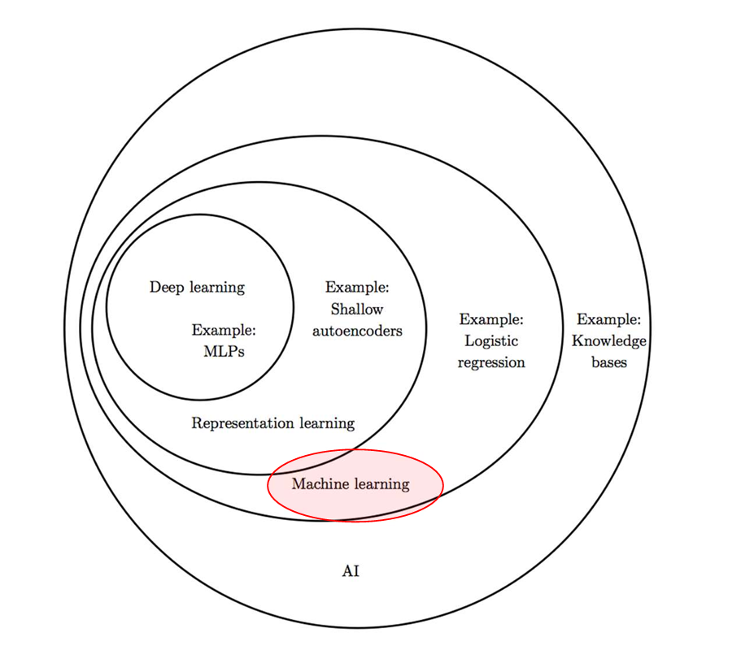

2.  First wave: cybernetics(1950-1970左右)

3. Second wave: back propagation, MLP, lots of cool ideas…(1980-2000 左右): MLP, RNN, LSTM, CNN

4. NN blooming again(2010左右) Advanced CNN, AlexNet, VGG


## Math

几个关键的矩阵知识

1. Norm 范数 L2范数 $||v|| _{2}=\sqrt{v_1^2+v_2^2+⋯+v_n^2}$

2. orthogonal矩阵，矩阵的逆等于其转置

3. Sigmoid $\sigma(x) = \frac{1}{1+exp(-x)}$，范围0-1

4. np数组在加上一个relatively很小的数不会有影响 

   ````python
   a = np.array([0., 1e-8]).astype('float32')
   ````


## Perceptron && Back propagation

Fully connected NN

基础感知器有以下组成部分
$$
𝑓(𝑥) = 𝑠𝑖𝑔𝑛(𝑤 ⋅ 𝑥 + 𝑏) 
$$

$$
𝑠𝑖𝑔𝑛(𝑥) = +1, 𝑥 ≥ 0;−1 , 𝑥 < 0
$$

Loss Function: Cross Entropy 
$$
L(y^{'}) = -\sum log(y_i^{'})* y_i
$$
对其中一个$y_i^{'}$可进行求导

output units, Hidden units, ...

Activation: 

1. sigmoid output(binary variable): 
   $$
   \sigma (x) = \frac {1} {1+exp(-x)}
   $$

   $$
   y = \sigma(wx+b)
   $$

   $$
   gradient = \sigma(x) * (1-\sigma(x))
   $$

2. softmax output(probability distribution):
   $$
   softmax(x_i) = \frac {exp(x_i)}{\sum exp(x_j)}
   $$

3. Hidden units ReLu $a = h(x) = max(x,0)$

4. tanh
   $$
   tanh(x) = \frac {e^x - e^{-x}} {e^x + e^{-x}}
   $$

   $$
   gradient = 1 - tanh^2(x)
   $$

### Forward propagation

流程是，对每一层进行计算，然后激活, 到最后一层的时候进行输出层激活


### Back propagation

反向传播的purpose: 通过梯度下降优化网络权重

链式法则，**就是前面所有传播回来的路径中梯度乘积之和**

矩阵表示，就是$\frac {dy} {dx} ^T$

取决于上一次的最后的gradient

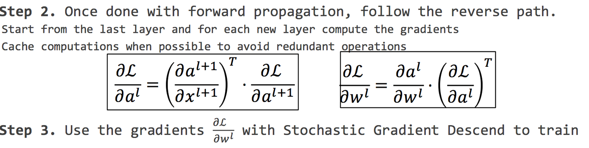

1. Local gradient 最后一步的gradient

2. Upstream gradient 从高层回来的gradient乘积

   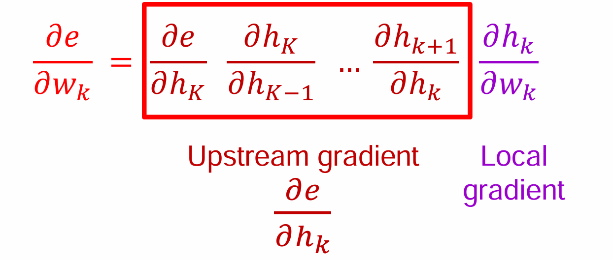

   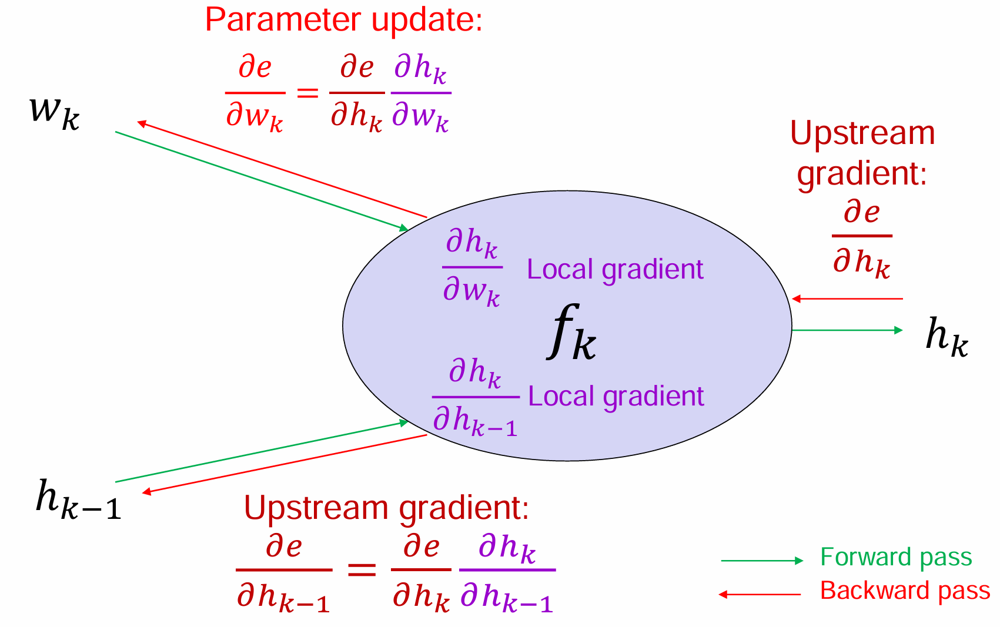

3. 关于反向传播具体计算的例子很重要！！ leture4 - 2 page-20

4. z = x*W

   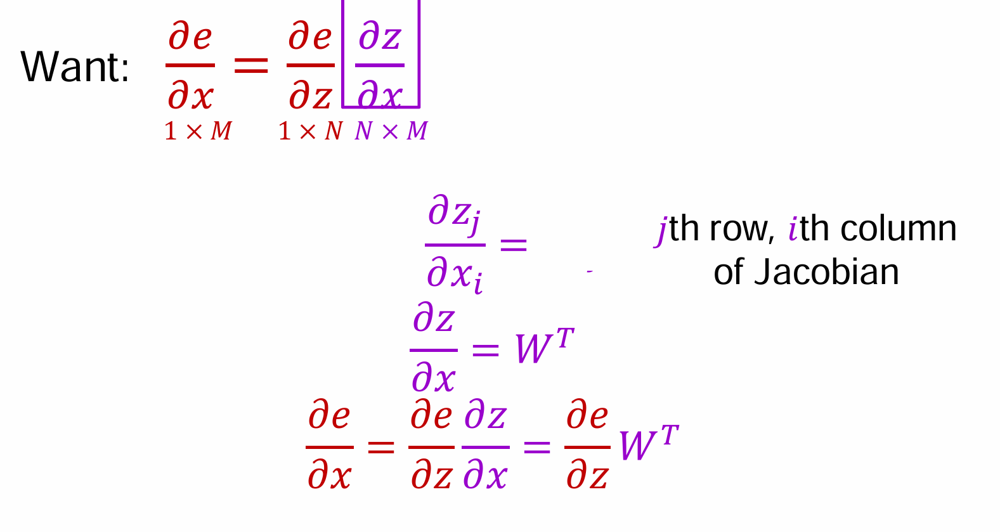

   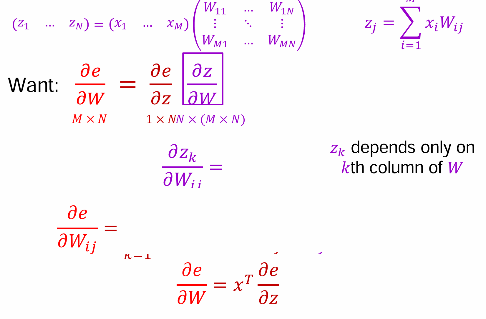


## Optimization && Regularization

1. Batch gradient descent，就是把一些数据集的gradient求平均然后一起下降，motivation(advantage)?

   1. 减小了波动的随机性
   2. 可以结合二阶导更好的确定下降方向

   当然也有一些disadvantage:

   1. 数据集太大了可能造成一起下降不现实
   2. 内存占用大
   3. 可能陷入局部最优

2. Stochastic gradient descent, 单个样本更新带有随机性，利于跳出局部最优，优点：

   1. 速度更快，每次更新计算量小
   2. randomness help avoid overfitting

   但是震荡会更明显，而且由于是每次都要更新完参数之后再下一个，所以无法并行计算

3. Mini-batch gradient descent, motivation是综合了SGD和BGD，认为综合他们的优点，既不样本量太少震荡大无法并行计算，又利于跳出局部最优

4. SGD vs GD

   1. SGD在数据随着时间变化时候表现良好
   2. SGD可以优先选择误差大梯度大的样本选择优先训练，这样可以使参数更新幅度更明显，更快减少总体误差
   3. 可以优化选择信息量更大的样本进行训练

5. **Optimization**

   引入optimization的motivation是会有局部值, 梯度爆炸和消失...

   1. First order information 

      - Momentum. 引入了velocity parameter, 思想就是考虑过去的梯度(用v得到加权之后的变化幅度)，让他们以一定的速度decay。目的是可以提高稳定性，更快收敛
      - Nesterov momentum 比较上一条，这一个基本相似，知识修改成了用future gradient，在梯度计算之前就根据上一步预测一下下一次的更新方向，相当于提前更新一下位置，这样可以获得better convergence

      然而momentum 这些方法 需要手动调整超参数，无法自动调整学习率，从而导致收敛缓慢，于是引入可以locally调整的，而不仅仅只能在global上做文章

      - Ada Gradient ，做法是记录历史的gradient更新学习率，这样比较稳定，但是过长的历史会让收敛很慢。主要是为凸函数(convex function)设计的 但是如果到了比较复杂的情况下比如局部极值，他就会过早停滞，导致难以跳出局部值

        Adapt learning rates of model parameters by scaling them inversely proportional to the **square root of the sum of all the past squared values of the gradient**

      - RMSprop，为了避免上一个做法的学习率衰减过快，引入了指数加权平均，更加平滑调整学习率 这个还可以在非凸函数(non-convex function)上表现更优(exponential moving average)

        区别就是using an exponential moving average

   2. Combination: Adam (RMSprop with SGD + momentum) 

      Momentum系列方法主要在优化参数的更新方向以及大小也就是梯度的方向，而ada系列方法主要在优化学习率

      momentum -> moving average of gradient

      ada -> scale learning rate

   3. Second order information

      利用牛顿法 Hessian矩阵提供更加精准的更新方向

      可能不怎么考？

6. Regularization

   motivation: 解决过拟合overfitting的问题

   1. L1 regularization, 引入sparsity，就是特征选择删去一些元之间的连接
   2. L2 regularization, 用途最广(weight decay), 在损失函数中添加了所有模型参数（权重）的平方和作为惩罚项，目标是**减小参数的大小**，从而防止模型过于依赖某些特定的特征
   3. Dataset augmentation，获得更多的训练数据！
   4. Early stopping，在validation error上升的时候就早停即使training error还在下降
   5. Dropout 随机以p的概率deactivate一些节点 这样可以更快的training, less overfitting, units more robust

7. Weight initialization

   初始化参数是很重要的，要weight asymmetricity

   较大的参数将会有较大的影响，但是也会exploding value

   较小的参数当然也不好

   所以一般用uniform distribution

8. Data pre-processing 数据预处理

   激活函数的用处：通常把数据集合到0附近，避免了饱和防止了梯度消失现象

   one-side饱和也挺好可以有效避免一些噪声的扰动

9. Normalization

   主要动机是通过调整数据或激活值的分布，使得神经网络的训练过程更加稳定、快速并且高效。具体来说加速收敛、避免梯度爆炸和消失 

   Batch normalization

   1. zero-centered (减去mean 然后divided by standard deviation) 对input数据进行预处理，所以也是input-normalization
   2. 层归一化是在每个输入样本的所有特征上进行标准化，而不是对整个小批次进行标准化 ？具体要掌握吗☆
   3. **批量归一化**会对每一层的激活的输出进行标准化，使得它们具有零均值和单位标准差。


##  Convolutional Neural Network(CNN)

### Basics

1. motivation: 引入CNN的动机是 保留间隙空间结构(卷积filter), 输入很大时候依旧保证计算效率(sparse connection, parameter sharing), 解决局部变异问题(不在乎局部的细小变化,pooling)
2. convolution
   - 一个例子：Sobel filter，Sobel滤波器常用于边缘检测
   - 卷积过程，每个kernel channel与原矩阵（加上padding之后）点乘之后求和加上bias
   - 卷积之后size可能会有个计算题！！★
   - sparse connection : 卷积核越小，信息越小，与别的神经元就越少，所以连接越稀疏
   - parameter sharing ：具有平移不变性
   - local connection: 像convolution一样卷积，拥有sparse connection，但是没有parameters sharing
   - strided convolution, Pooling 均是downsampling的策略，目的是减少输出feature map 的size
   - zero-padding control size：相当于如果在外面加了一层填充层，卷积之后size相对于原输入不变(doesn't shrink! 也是padding的motivation！)
   - pooling: 池化操作，保持最重要的information减小尺寸 当然也可以通过增加stride来减小尺寸而不用pooling


### Structure variance

1.  LeNet-5 7-level convolutional network, couldn't scale up to larger images

2. 接下来就是ImageNet的发展

   - AlexNet(5 convolutional layers + 3 fully connected layer) 相对于LeNet的tanh，这里使用ReLu,并且加入了**dropout**

   - VGG 16(key is increase the depth) 越深，filter数量增加，使用更小的核(3*3) 原因是：1. 堆叠结构多次Relu激活增强表达能力 2. 减少参数数量

   - GoogLeNet(**inception units**, batch normalization,  image distortions, RMSprop) 

     在Inception 中 很重要的层是**concat layer** 分成不同大小的卷积核，然后合并

     motivation是太深的网络由于大量的parameters而overfitting AND 大型的卷积操作计算量太大

     所以提出了**宽度为主**的网络，即**在同一层级上并行使用不同大小的卷积核**来提取多种尺度的特征。 然后使用**channel Concatenate**

   - ResNet( **The residual module**，解决**深度网络训练困难** 和 **梯度消失/爆炸**) 通过残差块尝试跳过一些连接避免过快的衰减(或者提供一些shortcut进行过渡),引入残差块和残差链接，通过bottleneck进行过渡可以减少计算量

   - FractalNet (key to good performance is not having skip connections  (residuals), but having both shallow and deep paths)

   -  Stochastic depth

   - Wide ResNet (Reduce number of residual blocks, but increase  number of feature maps in each block)

   - ResNeXt(increasing cardinality is a better way to increase capacity than increasing depth or width) 进行分组grouped convolutions 最后结果汇聚, cardinality就是#total_group

   - DenseNet 主要创新是**密集连接**，即每个卷积层的输入不仅仅是上一层的输出，还包括了所有前面层的输出。这种方式在每一层创建了一个“密集”的连接模式，使得网络能够更好地利用特征信息。 **Dense Block**

   - 总体来说，设计宗旨如下

     1. making more efficient
     2. 提高表达能力
     3. 适当时候跳过一些连接层以及创建与更早层的连接
     4. increase depth and reduce cost (比如用residual module，用dense block,用concat并行计算减少cost)


### Calculation

卷积核的深度(filter通道数)必须和上一层输出的通道数一致 AND 某一层输出特征图的通道数 = 当前层filter的个数

所以就比如对于32x32x3的图像，使用一个5x5x3的卷积核，最终会得到一个28x28x1的特征图。

公式
$$
size = \frac {a-b+2d}{c} + 1
$$


## Recurrent Neural Networks(RNN)

 long temporal dependencies 捕捉长期特征以及时序问题 为 motivation 引入了RNN

1. Basics: 引入Long-term memory, one-hot vector representation

2. RNN: 

   Vanilla RNN cell $h(t) = tanhW(x_t,h_{t-1})$

   BPTT (back propagation through time)

   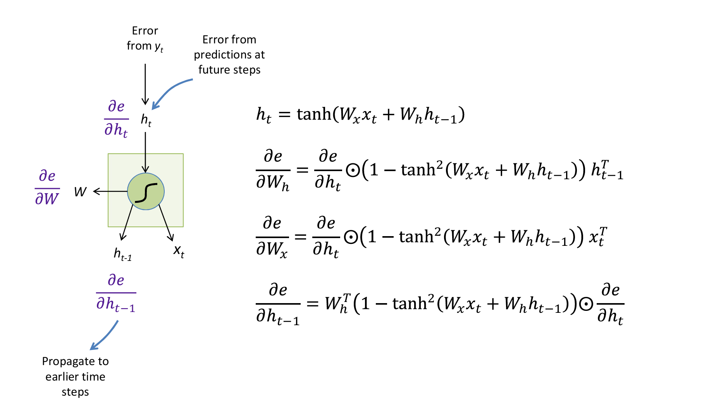

   HOWEVER, Gradients will vanish if largest singular value of $W_h^T$ is less than 1 所以会造成梯度爆炸以及梯度消失

   Exploding gradients are easily solved by rescaling or clipping the gradient BUT 梯度消失难以解决

3.  SO 引入LSTM

   1. First stage, we determine the percentage of long-term to be remembered(**Forget gate**)

      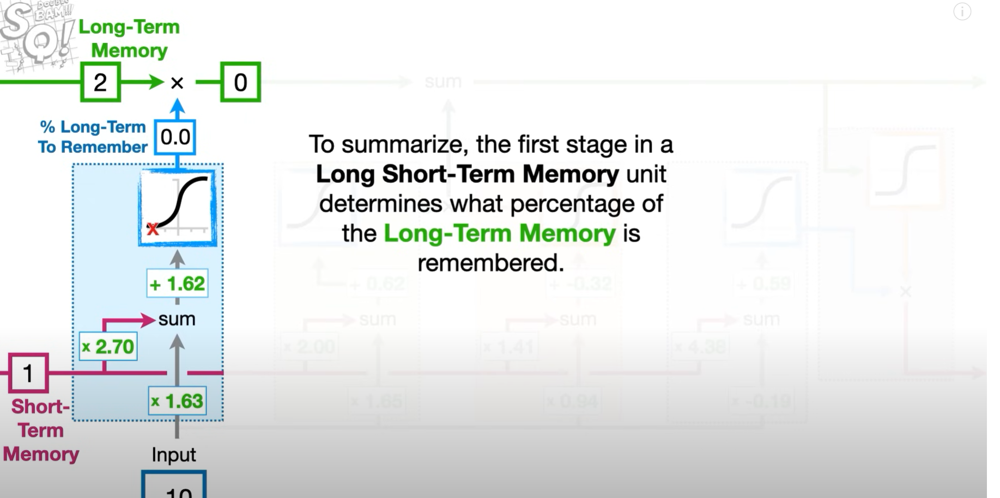

   2. Second stage, we determine potential long-term memory and and percentage to remember(Update long-term memory which the input is from input gate)

      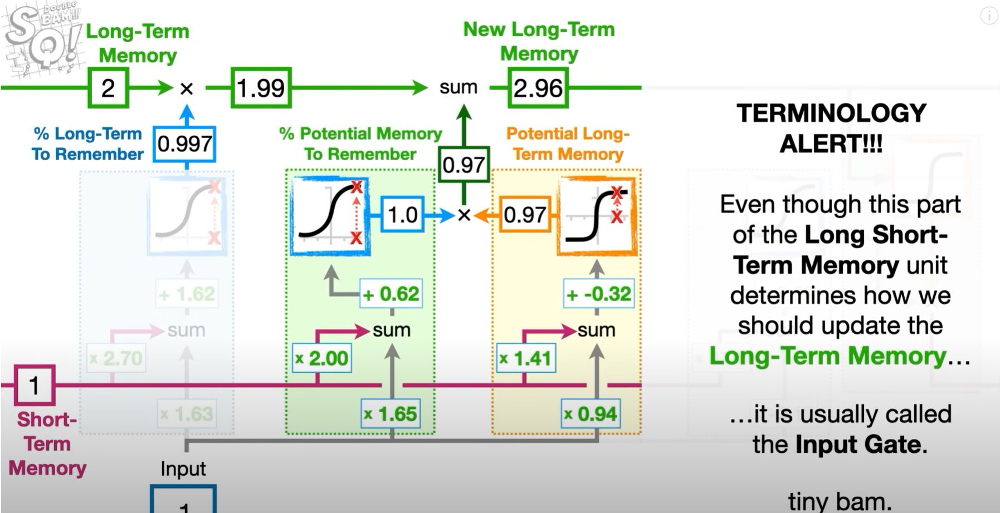

   3. Final stage, we determine potential short-term memory and and percentage to remember(Update short-term memory which is output gate)

      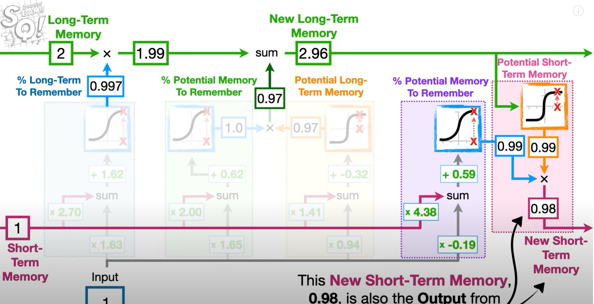

   4. The main difference and upgrade of LSTM compared to RNN is we can effectively solve the problem of gradient explosion and gradient vanishing. LSTM use the following components:

      1.  **Input gate**, which is to combine the input **previous hidden value and current value** and then determine how much information to update the **Long-term memory**.
      2.  **Output gate**, which is used to output current decision and determines how much information should be used to update the **Short-term memory**.
      3.  **Forget gate**, which is used to determine how much of the **Long-term memory** to remember with the combination of **previous Short-term and Long-term memory** and **current input**.

      Generally, LSTM is commonly be implemented as following:

      1. Firstly, we should determine the percentage the previous **Long-term** memory to remember. To be clear, we should use $h^{t-1}$ and $x^{t}$ to determine that. (**Forget gate**)
         $$
          f(t) = σ(W_{fx}x^{t} +W_{fh}h^{t-1} +b_f)
         $$
         where $h^{t-1}$ represent previous **Short-term memory**.

      2. Secondly, we should determine how to update **Long-term** memory using $h^{t-1}$ and $x^{t}$.

         - we compute the percentage of **Short-term memory** we should remember. That is (**Input gate**)
           $$
           i(t) = σ(W_{ix}x^{t} + W_{ih}h^{t-1} + b_{i})
           $$

         - Then, we compute potential additional **Long-term memory** with "the inspiration" of current value and add it to the previous **Long-term memory**
           $$
           g(t) = tanh(W_{gx}x^{t} + W_{gh}h^{t-1} + b_g)
           $$

           $$
           c(t) = g(t) ⊙ i(t) + c(t−1) ⊙ f(t)
           $$

           where $c(t)$ refers to **Long-term memory** and notice that, we use $tanh$ activation function here, because the output is within the range of $[-1,1]$

      3. Finally, we should determine our **Short-term memory** using the **New Long-term memory**

         - Similar to previous step, we compute the percentage memory we should remember from **Long-term memory** (**Output gate**)
           $$
           o(t) = σ(W_{ox}x^{t} + W_{oh}h^{t-1} + b_o)
           $$

         - Then, we compute the potential new **Short-term memory**, which is also the current output after activation
           $$
           h(t) = tanh(c(t)) ⊙ o(t)
           $$

      Following the 3 steps below, we can build a framework of traditional LSTM.

      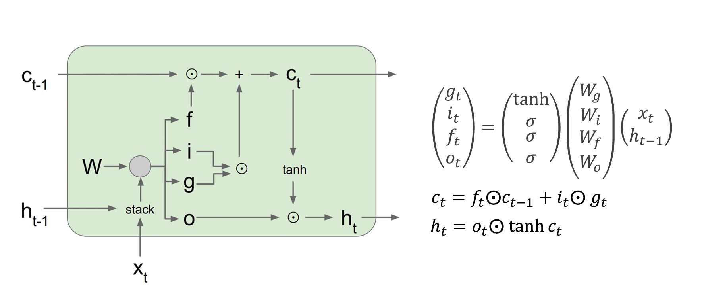

4. Gated Recurrent Unit (GRU)

   关系就是**Get rid of separate cell state** AND Merge “forget” and “output” gates into “update” gate AND 引入了reset gate

   LSTM中hidden state和cell state是分开的，但是GRU中都是在hidden state中直接存储信息

5. Other RNN structures

   1. Multi-layer RNNs
   2. Bi-direction RNNs
   3. 应用场景 (single/multiple input) -> (single/multiple output)  4 combinations

## Manifold Learning

motivation 主要是 **降低维度**、**提高数据表示效率** 和 **优化学习过程** because Real-world data lives in a low-dimensional non-linear manifold

**Manifold structure**（流形结构）是一个数学概念，指的是在高维空间中，数据点或者物体实际上是“嵌套”在某个较低维度的空间中的，或者说，它们遵循某种低维的结构。虽然我们观察到的数据是高维的，但它们的本质特征可以通过一个低维的**流形**来表示。

### PCA (Principle Component Analysis)

PCA(主成分分析)，用于降维操作，在高维分析时候将维度降低

1. 找两个维度，normalize data将数据分布在原点附近，然后随机一条直线找到最好fit的直线，最小化距离(最大化间隔) 这样做的目的是让点集尽量分散
2. 更高维度的就是不断按照以上的方法寻找$PC_i$，然后通过eigen-value找到其对variance的占比，如果说前两个PCA总和占比比较高的话，用这两个的坐标系就已经可以比较高的近似原来的数据集了。


### Autoencoder(AE)

**但是PCA考虑数据特征是正交的也就是独立的，所以只能捕捉到线性结构，所以捕捉数据空间结构能力依然受限，所以就引入AE**

Autoencoders learn to encode and decode input via a latent space

autoencoder针对高维的数据降维，相对于PCA来说更能处理更加高维的数据，encoder降维，decoder还原维度

1. undercomplete: code has lower dimension than input AND *f* or *g* has low capacity (e.g., linear *g*)
2. overcomplete: code has higher dimension than input AND must be regularized 他的目的是 Encourage the model to have other useful properties besides the ability to copy its input to its output 
3. Regularized AE
   - Sparse AE adding a cost term that penalizes the code for being larger 目的是 extract robust features or lower the dimensionality of the input data
   - Denoising AE Instead of adding penalty, change reconstruction error to account for the introduction of noise (重构误差，考虑数据本身的噪声) 相当于加入一个噪声然后再encode 这样让AE学习到了一个denoising map 可以进行降噪
   - Training AE combines two forces: Reconstruction and Limited capacity.
   - **Note**: the autoencoder can only afford to model the variations needed to reconstruct the training data AE并不是能表示所有的f函数
   - Contractive AE 添加正则(regularization)项到encoder (Penalizes the Frobenius norm of the Jacobian of the encoder)
   - Contractive AE and Denoising AE are able to learn the manifold structure of the data.


## VAE（variational autoencoder）

**然而AE缺乏生成能力, AE这个过程并没有明确的概率建模，也没有明确的生成过程。传统AE只关心压缩数据和重建数据之间的误差，缺乏对生成数据的控制能力**

**所以引入VAE，那么VAE的最大优势之一是其能够对数据生成过程进行建模，并将该过程通过概率论框架实现。**VAE的核心是将数据点视为由潜在变量（latent variables）由**Latent Variables层**生成的，而这些潜在变量服从一个特定的概率分布。通过最大化数据的似然函数（likelihood），VAE能够 学习数据的生成分布

本身的想法(motivation)是 针对simple autoencoder, 这里的bottleneck也就是降维之后的我们用两个参数表示，一个是mean一个是var，相当于是记录的是分布distribution中的分布信息。so for one data point we can sample many codes z

**Latent Variable Layer** 生成mean和var两个参数，然后通过**sampled layer**(Reparameterization Layer)重建生成latent variables也就是sampled vector z，最后通过decoder来重建

接着，通过$z=μ+σ⋅ϵ$得到sampled vector $z$ , 最后再经过decoder来进行重建。

loss_function其实是通过autoencoder中的loss（只是变成了期望因为本质是一个分布, MLE最大似然估计）再加上KL散度 (regularization term)	

而**KL散度**的作用是**正则化潜在空间**，它迫使潜在变量的分布接近于标准正态分布。这有助于避免编码器输出的潜在变量分布过于复杂，且避免模型对输入数据的过拟合。

**潜在空间** latent space的计算很重要，所以KL对Loss的影响是不可忽视的


## Generative adversarial networks(GAN)

由VAE过渡到generative tasks, 所以就引入了GAN

motivation是注意到VAE可以学习生成图像, 但是我们怎么判定图像的质量呢？loss function是什么呢

他们做的事情就是：

- **Generator**: G(*z*) takes random noise *z* as input and outputs a (fake) image
- **Discriminator**: D(*x*) receives an image x in input, real or fake, and estimates its probability to be real
- **Note**: both the generator and the discriminator need to be differentiable

Parameters updating process is the following formula (minimax and zero-sum game)
$$
\min_G \max_D V(D, G) = \mathbb{E}_{x～{p_{data}(x)}}[\log D(X)] + \mathbb{E}_{z～p_{z}(z)}[\log(1 - D(G(Z)))]
$$
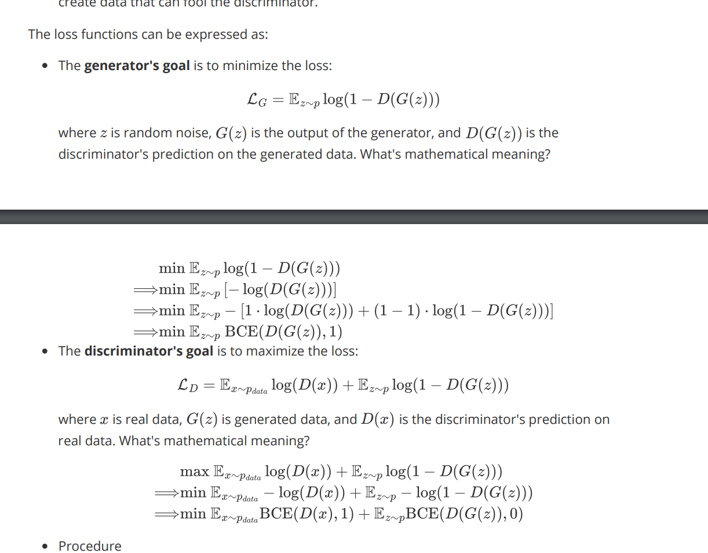

G is trained to minimize log(1 − D(G(*z*))), i.e., fool the discriminator

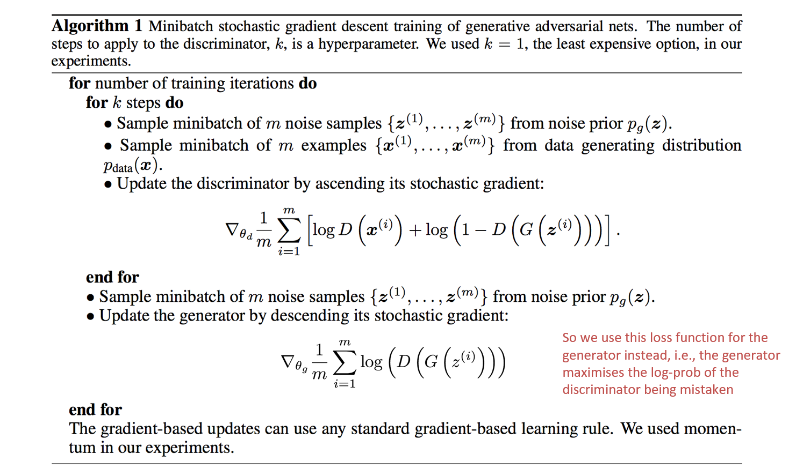

上面的式子也是D的loss function, 下面的是G的loss function

- DCGAN 相对于GAN 批量归一化，去掉全连接层...
- cGAN 通过引入条件信息来控制生成的数据，从而使得生成器能够根据特定的条件生成指定类型的数据。相较于传统的 GAN，cGAN 在生成数据时不再完全依赖于随机噪声向量，而是将某些额外的信息（如标签、图像、文本等）作为条件输入到生成器和判别器中。这种方法提升了生成任务的控制性和灵活性，尤其是在需要生成特定类型或具有特定属性的数据时。(不完全是随机噪声输入，而是有意义的信息)

GAN也有一些limitations

1. finite sample size(training set is finite, not the full distribution)
2. limited capacity(the generator has limit capacity)
3. optimizer may stuck at local optima
4. hard to balance D and G ability
5. hard to find a maximum or minimum


## Adversarial Examples

1. How to fool?

   - perturbation: 在原有基础上做出一些轻微扰动，让分类器misclassified

   - Gradient Ascent: easier to take small gradient steps in desired direction 

   - Linear Analysis: To fool a linear classifier, add a small multiple of the target class weights to the test example

     That is $f(x,\hat{y})=w^T x:x←x+η w$

   - Generating Adversarial example

     1. Fast gradient sign method(FGSM)

        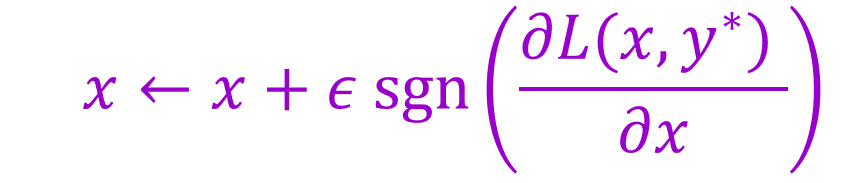

     2. Iterative gradient sign method(每次步长比较小)

     3. Least likely class method

   - Black-box attack: 通过使用合成输入数据来学习目标网络的替代模型（substitute network），然后使用该替代模型来生成对抗性样本（adversarial examples）

2. Properties of Adversarial Examples

   1. 对任何image输入，应该是很容易生成很相似的图片让他misclassified
   2. 并不需要precise gradient ascent
   3. Adversarial examples有些时候是在printed or photographed之后可以survive
   4. 可能通过同样的perturbation攻击很多不同的Image
   5. 这样的Adversarial examples如果能够fool一个network，那么有很大概率也能fool不同parameter的其他network

3. Why deep network easy to fool?

   1. 过于线性,很容易操作output in a predictable way
   2. 维度过高，在某一个维度上修改很小的amount难以察觉
   3. 神经网络可以拟合任何数据，但没有任何机制防止它们在训练样本之间表现不稳定。反直觉地，一个网络可以在自然图像上具有良好的泛化能力，但仍然容易受到对抗性样本的攻击。

4. SO how to defend(main approaches)

   1. 强化训练，用对抗性例子进行强化训练 (Train a separate model to reject adversarial examples: SafetyNet)
   2. Design highly **nonlinear** architectures robust to adversarial perturbations
   3. Pre-process input images to disrupt adversarial perturbations (提前进行降噪等操作减轻对抗性扰动的效果)


## Beyond vectors: DL on graphs

介绍了 Feature 和 Structure; 前者是 Object as set of extracted **features**，而后者强调Object as components in **relation** with each other

两个构建Graph的重要矩阵：Degree Matrix(只有对角线上有元素, D) && Adjacent Matrix(A)  而Laplacian Matrix L = D - A

目前所学的是Learning based on vectors, HOWEVER, turning a graph into a vector并不easy, 比如图的size可能会vary以及节点的order会vary

**几种Graph Learning的类别(Graph Classification, Node Classification, Link Prediction)**

GCN **input: node features Matrix H (N nodes * F features) + Adjacent Matrix (N * N)**

GCN **output: Matrix Z(every row i is the output feature of node i)  OR single label of G**

$$
H(l+1) = RELU(AH(l)W(l))
$$
对于一层的Layer计算公式如上，比方说在l=0时候，$AH(l)$就是邻接矩阵(N\*N)和node-feature矩阵的乘积(N\*F),每一组行乘列都是对于每个节点的某个特征考虑了所有相邻节点的对应特征和

HOWEVER 有些问题：

1. The feature at node i is NOT included in the computation of the new aggregated feature at node i. （因为在计算时候自己的对应的邻接矩阵值永远是0）
2. 每个node有不同的degree，可能会导致gradient explosion or vanishing problem

THEN how to modify: 

1. 添加一个loop，使得旧的feature在新的feature中保留
2. Normalize A 使得scale of feature vector不变


Node Classification: We can add a Softmax layer at the end and apply the GCN to predict the labels of the nodes of a graph, where some of the nodes already have labels (training set)

Graph Classification: The previous architecture can be extended to deal with graph classifications (i.e., one label per graph) by combining the node-level features in a single graph-level feature.


## Appendix

1. About Pytorch

   ````python
   # numpy 与 tensor 之间的相互转换
   data = [[1, 2],[3, 4]]
   # tensor to array
   x_tensor = torch.tensor(data); print(x_tensor)
   x_tensor2array = x_tensor.numpy(); print(x_tensor2array); print()
   # array to tensor
   x_array = np.array(data); print(x_array)
   x_array2tenor = torch.from_numpy(x_array); print(x_array2tenor)
   
   # empty/rand/ones/zeros/eye(), xxx_like()
   # the difference is you can fill dimensions without brackets at the beginning for these functions
   x = torch.empty(2, 3); print(x)
   x = torch.randn(2, 3); print(x) # initialization from the Gaussian distribution of N(0,1) rand就是一个根据概率分布的随机
   # cuda() means translating your tensors into GPUs
   x = torch.zeros(2, 3, dtype=torch.float).cuda(); print(x) # if your device is CPU, please delete the cuda()
   y = torch.rand_like(x) # _like means the same shape, data type and device(GPU or CPU)
   print(y) 
   
   # np.squeeze() reduce the dimensions of "1"
   t = np.eye(5) # identity matrix
   print(t, t.shape)
   # 创建5*5的one-hot representation
   ````

   乘法时候需要注意几点

   ````
   torch.mul() equals "*": Element-wise multiplication
   torch.mm(): the common mathematical matrix multiplication
   torch.matmul() equals "@": Matrix product of two tensors, it includes matrix multiplication methods of different dimensions
   ````

   

